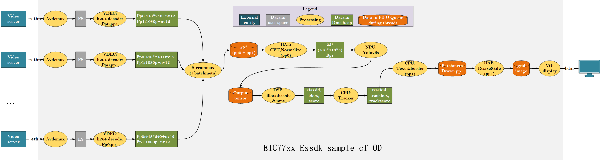

# od_readme

本 README 面向 `pipeline/case/od` 目标检测多路演示用例，帮助你：
- 快速理解本 case 实现的功能与数据流拓扑；
- 参考现有实现，按需修改为你的业务所需的类似案例；
- 正确部署并运行本 case，复现运行效果。

关联文件位置：
- 脚本：`pipeline/case/od/od_pipeline.sh`、`pipeline/case/od/od_pipeline_release.sh`
- 配置：`pipeline/case/od/config/*.yaml`
- 说明图：`pipeline/case/od/image.png`

---

## 案例整体功能描述

本案例展示在单设备上同时处理多路视频（示例为 25 路 1080P），完成“解复用与解码 → 图像预处理 → 目标检测推理 → 结果后处理与目标跟踪 → 叠加可视化 → 多画面拼接 → 4K 显示输出”的端到端实时目标检测能力。系统通过 `EsMux` 将各路解码帧汇聚，使用 `EsQueue` 实现算子间解耦缓冲，`EsPreProcess`/`EsInfer`/`EsPostProcess` 形成检测主链路，`EsTracker` 稳定目标 ID 与轨迹，`EsOsd` 完成框与标签叠加，`EsVideoGrid` 将多路画面拼接为 5×5 网格，最终由 `EsVideoSink` 输出到 HDMI 显示。该案例可作为用户自定义多路智能分析方案的模板，支持快速替换输入源、模型与可视化样式并进行性能调优。

---

## 1. 功能与数据流拓扑

本 case 演示“多路视频输入 → 解码 → 汇聚 → 预处理 → 推理 → 后处理/跟踪 → OSD → 多画面拼接 → 显示”的完整流程。示意图见目录下 `image.png`。

数据流图（示意）：



```
EsAvDemux xN  ->  EsVdec xN  --->  EsMux("mux1")  ->  EsQueue  ->  EsPreProcess  ->  EsInfer  ->  EsQueue  ->  EsPostProcess  ->  EsTracker  ->  EsOsd  ->  EsQueue  ->  EsVideoGrid  ->  EsQueue  ->  EsVideoSink
    |                |                 ^                                                                                                                                            
    +----------------+-----------------+  其余解码路通过 `element -name mux1` 并入同一汇聚点                                                                                           
```

元素功能说明（结合本 case）：
- EsAvDemux：读取码流（文件/IPC 等），向下游输出压缩帧；每路对应一个 YAML（如 `EsAvDemux_1.yaml`）。
- EsVdec：将上游压缩帧解码为图像帧（NV12 等）；每路独立实例，配置统一使用 `EsVdec.yaml`。
- EsMux：将多路解码输出按时间片汇聚成一个统一的输出队列，保障后续算子按路序/时间推进。
- EsQueue：解耦上下游速率，形成缓冲区，避免背压影响整体吞吐。
- EsPreProcess：对图像做缩放、色彩空间转换、归一化等，准备推理输入 tensor。
- EsInfer：加载并执行目标检测模型（如 YOLO），产生候选框与类别置信度等输出张量。
- EsPostProcess：解析推理输出，执行阈值过滤、NMS 等，得到结构化检测结果。
- EsTracker：可选跟踪模块，在帧间关联目标，稳定 ID 与轨迹，提升观感与鲁棒性。
- EsOsd：在原始帧上叠加检测框、类别与分数、LOGO 等可视化信息。
- EsVideoGrid：将多路画面拼接为网格（默认 5×5 输出 4K），用于总览显示。
- EsVideoSink：视频输出（VO/HDMI），将最终画面送至显示设备。

典型参数：
- 通道数：最多 25 路（脚本中演示 25 路）
- 分辨率：1080P 输入，多画面拼接输出 4K（5×5 网格）
- 解码：H.265/H.264（以 YAML 为准）
- 模型：YOLO 系列（以 `EsInfer.yaml` 为准）

核心元素链路（按执行顺序）：
1) 多个 `EsAvDemux`（文件或 IPC 拉流）
2) 多个 `EsVdec` 解码器（逐路）
3) 一个 `EsMux`（多路解码帧汇聚）
4) `EsQueue`（解耦缓冲）
5) `EsPreProcess`（缩放、颜色空间、归一化等）
6) `EsInfer`（NPU/DSP 推理）
7) `EsQueue`（解耦缓冲）
8) `EsPostProcess`（解析检测框、NMS 等）
9) `EsTracker`（跨帧跟踪，可选）
10) `EsOsd`（叠加框/标签/分数/LOGO）
11) `EsQueue`（解耦缓冲）
12) `EsVideoGrid`（多路画面拼接 5×5）
13) `EsQueue`（解耦缓冲）
14) `EsVideoSink`（VO 输出到 HDMI）

---

## 2. 运行方法

推荐直接使用脚本：
```bash
# 设备端 Linux shell
sh pipeline/case/od/od_pipeline.sh
```
脚本内关键环境与参数：
- `PATH`：指向可执行 `espl_launch`
- `PL_LOG_LEVEL`：日志级别（4=INFO）
- `echo 1 > /proc/eswin/vb`：启用 VB（视频缓冲）
- `ulimit`：放开 core/锁内存/栈等限制，保证大并发下稳定
- `case_path=/opt/demo/pipeline/case/od`：配置根目录（脚本以此为默认）
- `cloopnum=200000000`：循环读帧次数（近似“无穷”）

脚本核心调用（节选，真实语法）：
```bash
espl_launch \
  perfstat_interval 10000000 \
  config_path $case_path/config/ \
  EsAvDemux -path EsAvDemux_1.yaml  -loopnum $cloopnum - ! EsVdec -name decoder1  -path EsVdec.yaml - ! EsMux -name mux1 -timeout 40 -poolsize 16 - \
  EsAvDemux -path EsAvDemux_2.yaml  -loopnum $cloopnum - ! EsVdec -name decoder2  -path EsVdec.yaml - ! element -name mux1 - \
  ...（重复到 25 路）... \
  ! EsQueue -name queuepreproc1 -type 0 -deepth 5 - \
  ! EsPreProcess -name preproc1 -path EsPreProcess.yaml - \
  ! EsInfer -name infer1 -path EsInfer.yaml - \
  ! EsQueue -name queuepost1 -type 0 -deepth 5 - ! EsPostProcess -name post1 -path EsPostProcess.yaml - \
  ! EsTracker -name tracker1 -path EsTracker.yaml - \
  ! EsOsd -name osd1 -path EsOsd.yaml - \
  ! EsQueue -name queuegrid1 -type 0 -deepth 5 - \
  ! EsVideoGrid -name videogrid1 -path EsVideoGrid.yaml - \
  ! EsQueue -name queuevo1 -type 0 -deepth 5 - \
  ! EsVideoSink -name vo1 -path EsVideoSink.yaml -
```
说明：
- `config_path` 为全局配置根目录，后续元素 `-path` 均为相对路径；
- 多路输入通过重复 `EsAvDemux + EsVdec` 组合实现；
- 第一路创建 `EsMux -name mux1`，后续路使用 `element -name mux1` 把解码输出并入同一个 MUX；
- `!` 用于结束一个元素的子参数段；`-` 是继续标记（与脚本风格相关）；
- 具体可调参数以各 YAML 为准。

---

## 3. 配置文件总览与要点

配置目录：`pipeline/case/od/config/`

输入与解码：
- `EsAvDemux_*.yaml`：每路输入的源配置（文件/IPC 等），示例：`EsAvDemux_1.yaml`、`EsAvDemux_ipc.yaml` 等；
- `EsVdec.yaml`：解码参数（码流类型、输出格式等）。

前处理/推理/后处理：
- `EsPreProcess.yaml`：输入尺寸、像素格式、归一化方式等；
- `EsInfer.yaml`：模型路径、是否异步等（注意参数名与实际实现一致，如使用 `isAsync` 而非 `inferType`，并可补充 `dumpflag` 等必要项）；
- `EsPostProcess.yaml`：类别数、阈值、NMS 等；
- `EsTracker.yaml`：跟踪器参数（FPS、IOU 阈值、质量阈值等，可根据业务调整）。

可视化与输出：
- `EsOsd.yaml`：框/标签样式、是否叠加 LOGO 等；
- `EsVideoGrid.yaml`：网格布局（如 5×5）、目标分辨率；
- `EsVideoSink.yaml`：显示输出（接口、分辨率，如 4K HDMI）。

---

## 4. 定制与扩展指南

你可以基于本 case 快速做出以下定制：

- 调整路数：
  - 复制/删除 `EsAvDemux_X.yaml` 并在脚本内对应增加/减少 `EsAvDemux + EsVdec` 组；
  - 修改 `EsVideoGrid.yaml` 的行列布局（例如 4×4/3×3），并确认输出分辨率与显示能力匹配。

- 更换输入：
  - 文件播放：编辑 `EsAvDemux_X.yaml` 的本地文件路径；
  - IPC 拉流：改用 `EsAvDemux_ipc*.yaml` 并配置 RTSP/协议参数。

- 更换/微调模型：
  - 在 `EsInfer.yaml` 中替换 `model-filepath`，并设置 `isAsync`、`inferOutputPoolSize` 等；
  - 同步调整 `EsPreProcess.yaml` 与 `EsPostProcess.yaml` 的尺寸/锚点/阈值以匹配模型。

- 性能与稳定性：
  - `EsMux -poolsize`、各 `EsQueue -deepth` 控制缓冲能力；
  - 适当增大 `perfstat_interval` 以降低统计开销；
  - 在多 DIE/NUMA 设备上为关键元素加 `-die` 亲和（若平台支持）。

- 叠加与输出：
  - 在 `EsOsd.yaml` 调整字体/颜色/文案；
  - 在 `EsVideoSink.yaml` 切换不同输出模式（1080P/4K 等）。

- 插件化扩展：
  - 参照 `pipeline/src/elements/*` 实现自定义元素（继承 `CElement`），并提供工厂导出；
  - 通过 pl_launch 的令牌机制在脚本中插入你的元素（详见 `pipeline/src/pl_launch/pl_launch_readme.md`）。

---

## 5. 常见问题与排错

- 运行无画面/无输出：
  - 检查 `EsVideoSink.yaml` 是否匹配显示设备；确认 `HDMI` 连接；
  - 查看 `EsVideoGrid.yaml` 网格与输入通道数是否一致。

- 无检测框：
  - 核对 `EsInfer.yaml` 的模型路径与参数；
  - 检查 `EsPreProcess.yaml` 尺寸/归一化与模型是否一致；
  - 调整 `EsPostProcess.yaml` 的置信度/NMS 阈值。

- 帧率/卡顿：
  - 增大 `EsQueue -deepth` 与 `EsMux -poolsize`；
  - 关闭或放宽 dump/日志；
  - 检查输入码率是否过高、存储/网络是否成为瓶颈。

- 动态库/元素找不到：
  - 确认 `lib_path` 与可执行 `espl_launch` 在 `PATH/LD_LIBRARY_PATH`；
  - 元素令牌大小写与脚本一致，`-path` 为相对 `config_path`。

---

## 6. 参考
- `pipeline/case/od/od_pipeline.sh`
- `pipeline/src/pl_launch/pl_launch_readme.md`
- 各元素 README 与 `pipeline/src/core/core_readme.md`
